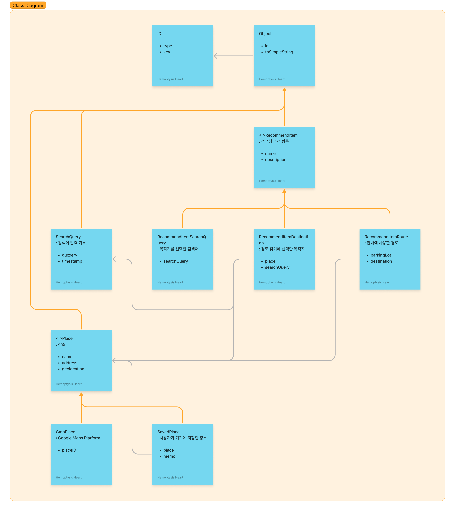

# 정보 구조 (Information Architecture

## 타입

### `ID`

앱 내부 데이터 인식용 ID.

### `Object`

앱 내부 데이터를 통합 관리할 방법을 만들기 위한 상위 타입.

### `<I>RecommendItem`

검색 추천 항목.

#### `RecommendItemSearchQuery`

목적지를 선택한 검색어

#### `RecommendItemDestination`

경로 찾기에 선택한 목적지

#### `RecommendItemRoute`

안내에 사용한 경로

### `SearchQuery`

검색어 입력 기록.

### `<I>Place`

장소

#### `GmpPlace`

Google Maps Platform

#### `SavedPlace`

사용자가 기기에 저장한 장소

#### (보류) W3W

언어별 [what3words](https://what3words.com) 정보.

- 실내 정보까지는 관리할 수 없지만, 차에서 내린 후의 실내 이동 최소화와 최적화에 활용할 수 있다.
