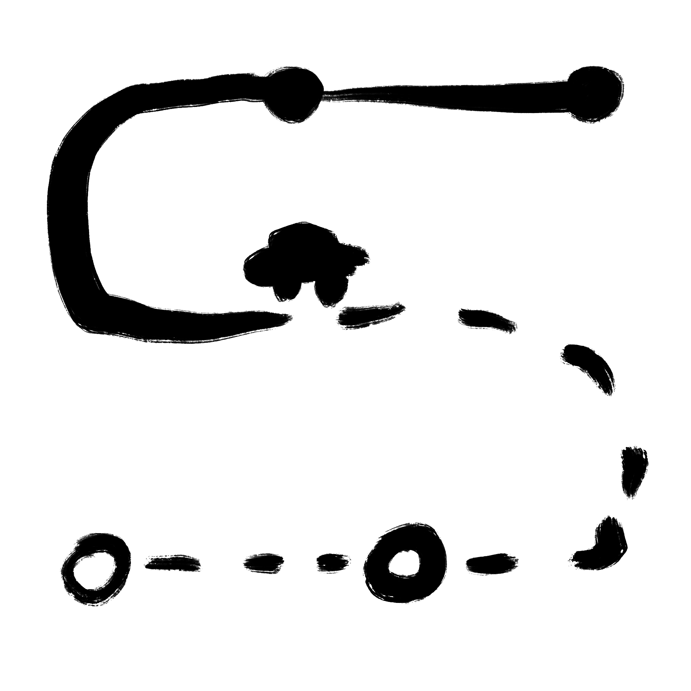

# Launcher Icon

## DALL·E

이미지 그릴 실력도, 시간도 없기 때문에 애플리케이션 아이콘을 [DALL·E](https://labs.openai.com)로 생성했다. 마침 공개로 풀렸으니까.

그런데 만들어보면 볼수록 어디서 본것 같은 결과만 나온다. 그냥 비슷한 검색어로 검색하면 거의 같은 이미지가 나오기 때문에 DALL·E로 아이콘 만들기는 포기.

1. Description : `mobile application square icon of parking lot finder without any text` 
    
   꽤 괜찮은 느낌이지만, 아래쪽에 그림자가 있는 게 마음에 안든다.
2. Description : `mobile application square icon, parking lot finder without text and without shadow` 
    
   왠지 칙칙하고 자동차 혹은 주차장 관련 정보가 없다.
3. Description : `app icon, parking lot finder, no text, no shadow` 
    
   칙칙하고, 경계선도 깔끔하지 않다.
4. Description : `path finding, parking lot, driving assistant, vehicle navigation` 
    
   주차장도 있고 자동차도 있고 이동경로도 보이지만 너무 복잡하다.
5. Description : `path finding, parking lot, driving assistant, vehicle navigation` 
    
   같은 이유. 아이콘으로 쓰기엔 너무 복잡하다.
6. Description : `material, app icon, path finding, parking lot, driving assistant, vehicle navigation` 
    
   깔끔하고 지도 느낌도 나지만 주차 정보인지는 모르겠다.
7. Description : `material, app icon, path finding, parking lot, driving assistant, vehicle navigation, extendable` 
    
   자동차가 있으면 좋겠다.
8. Description : `material, app icon, path finding, search parking lot, car icon, driving assistant, vehicle navigation` 
    
   자동차도 있고 주차장 검색도 있지만 길안내 정보는 없고 무엇보다 자동차 외곽선이 깔끔하지 않다.
9. Description : `material, app icon with car, clear shape, search parking lot, white background` 
    
   괜찮아 보이는 것 같긴 한데 역시 칙칙하다.

## 그리기

그래서 직접 그렸다.

